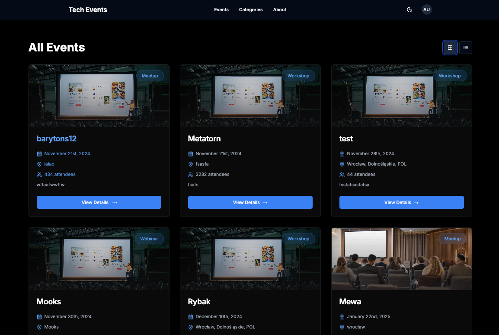
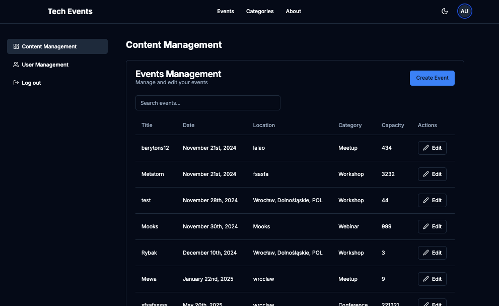
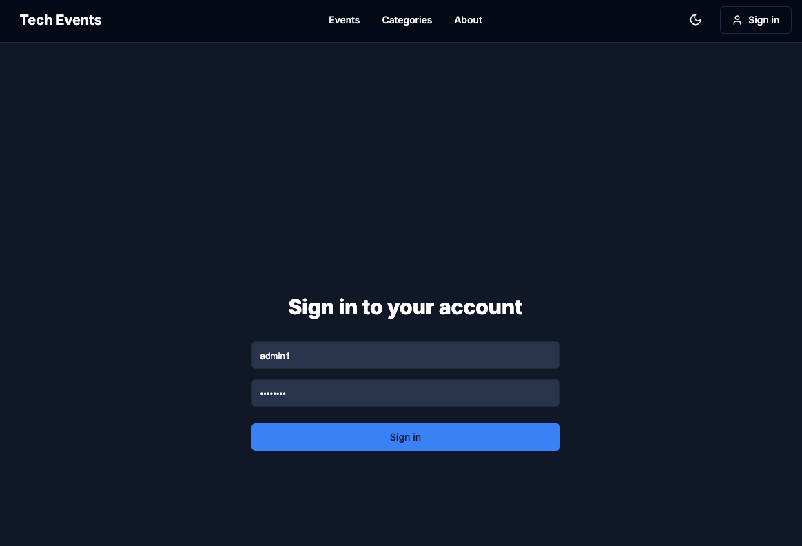

# Event Platform - Recruitment Task






## 🎯 Project Overview
A full-stack event management platform built with Next.js 15, Sanity CMS, and NextAuth. Created as a recruitment task demonstrating modern web development practices.

## 🛠 Tech Stack
- Next.js 15
- TypeScript
- Sanity CMS
- NextAuth.js
- TailwindCSS
- Shadcn/ui

## ✨ Key Features
- Role-based authentication (Admin/User)
- Event management with different permissions
- Real-time updates
- Responsive design
- Modern UI with Shadcn components

## 📚 Documentation
- [Technical Documentation](./instruction.md) - Setup & configuration
- [Project Estimation](./estimation.md) - Timeline & resource planning

## 🔑 Test Credentials
```
Admin:
- Username: admin
- Password: admin123

Regular User:
- Username: user1
- Password: user123
```

## 🏗 Local Development
1. Clone & install dependencies
2. Set up Sanity (credentials in email)
3. Run development servers

Detailed setup instructions in [Technical Documentation](./instruction.md)

## 💡 Implementation Highlights
- Clean architecture
- Type safety
- Modern React patterns
- Performance optimizations
- Proper error handling

## 🎯 Task Requirements Met
- [x] Authentication & Authorization
- [x] Role-based access control
- [x] Event management
- [x] Admin panel
- [x] User restrictions
- [x] Real-time updates

## 📝 Notes for Reviewers
- Project uses free tiers of all services
- Sample data is included
- All core functionality is implemented
- Code follows best practices
